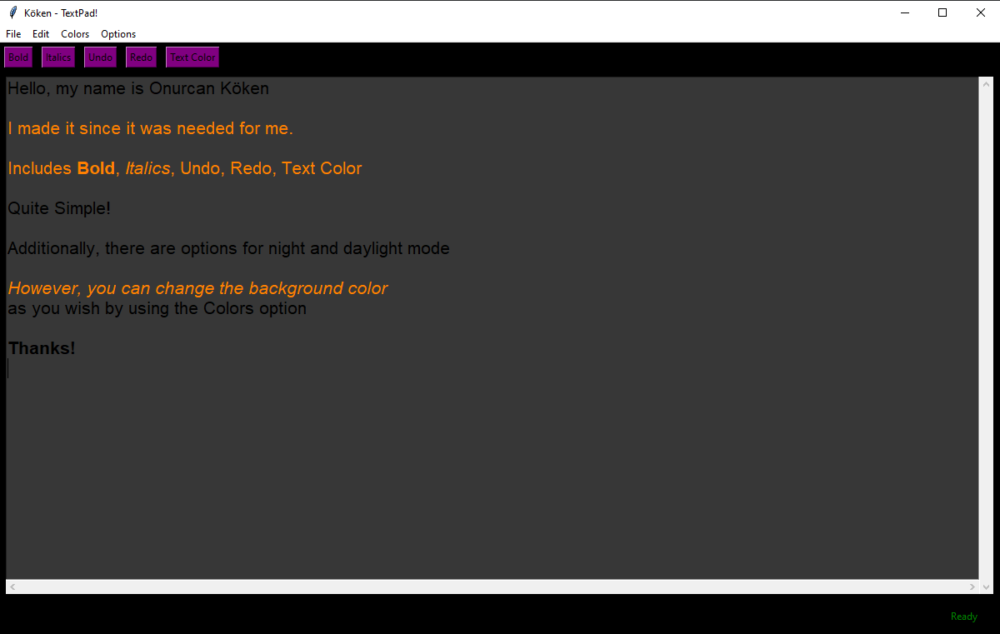

# Black_Text_Editor
 Black Background Text Editor with Tkinter
  
Onurcan Köken

There was a need for me to write it down my notes but the background colors was not suitable for me. Therefore, I have made my own one with a black background but the colors are changeable. The original version of this project is also included in my repository. To be able to use my gui, go to dist folder and execute `black_textpad.exe` file.

Reference: https://github.com/flatplanet/Intro-To-TKinter-Youtube-Course/blob/master/textpad.py
To create .exe file, i have used: https://www.youtube.com/watch?v=_nhiXxFCT34
